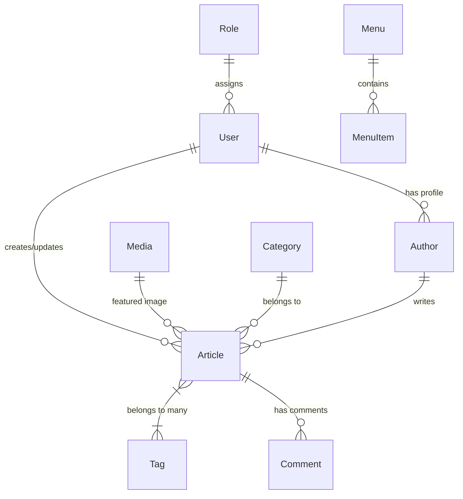

# مشروع Editorial - تحليل شامل لنظام إدارة المحتوى والمجلة الرقمية (Editorial CMS API)
**تاريخ التحليل المحدث:** 2026-08-05  
**الإصدار:** Laravel 12.x / PHP 8.4+

---

## 1. 📌 نظرة عامة على المشروع (Project Overview)

مشروع **Editorial** هو **نظام إدارة محتوى إخباري ومجلة رقمية متكاملة (Editorial Content Management System - CMS API)** مبني على إطار العمل **Laravel 12** مع **PHP 8.4**.

تم تصميم المشروع وفقاً لمعايير **RESTful API Architecture** ليكون خفيف الوزن وسريع الاستجابة ومفصولاً تماماً عن واجهات العرض (Headless CMS)، مما يتيح له تغذية تطبيقات ويب متعددة (مثل منصة `Quick` أو واجهات SPA) وتطبيقات الهواتف الذكية.

### 🌟 الميزات الرئيسية للنظام:
- **نظام مصادقة وأمان متطور:** دعم كامل لـ **Laravel Sanctum** لحماية نقاط النهاية وتوليد توكينات الوصول (API Access Tokens).
- **إدارة الأدوار والمستخدمين (RBAC):** التحكم بالمستخدمين والأدوار (Admin, Editor, Author, User) وحالات الحساب (Active, Inactive, Suspended).
- **دعم التدويل واللغات (Multi-language i18n):** دعم الرسائل والاستجابات باللغتين العربية (`ar`) والإنجليزية (`en`).
- **تحسين محركات البحث (SEO Engine):** توليد تلقائي للروابط اللطيفة (Slugs)، حساب وقت القراءة المتوقع (`reading_time`)، إدارة الميتا تايتل والميتا ديسكريبشن، وخريطة موقع ديناميكية (`sitemap.xml`).
- **نظام تفاعلي متكامل:** تعليقات هرمية متعددة المستويات، إدارة المساحات الإعلانية وتتبع النقرات والظهور، استقبال رسائل التواصل والرد البريدي المباشر عليها، وإدارة مشتركي النشرة البريدية.

---

## 2. 🏗️ البنية التحتية والتقنيات (Tech Stack & Dependencies)

| المكون / التقنية | الإصدار / الغرض |
| :--- | :--- |
| **PHP** | `8.4+` (لغة البرمجة الأساسية مع تحسينات الأداء وتحديد الأنواع) |
| **Laravel Framework** | `12.x` (إطار العمل الرئيسي لبناء الـ REST API والموديلات والخدمات) |
| **Laravel Sanctum** | إدارة المصادقة والتأمين عبر التوكينات (Personal Access Tokens) |
| **Database** | SQLite / MySQL / PostgreSQL (تخزين البيانات والعلاقات المترابطة) |
| **Composer** | إدارة حزم PHP واعتمديات النظام |
| **Media & WebP Support** | معالجة وسائط الصور ودعم الامتدادات الحديثة وإدارة الأحجام |
| **Localization System** | دعم ترجمة JSON والرسائل الاستجابية المترجمة (Arabic / English) |

---

## 3. 📂 الهيكلية العامة للملفات والمجلدات (Project Directory Structure)

يتكون مشروع **Editorial** من هيكلية منظمّة ومقسمة حسب مسؤوليات البرمجة والنظافة (Clean Architecture):

```text
Editorial/
├── app/
│   ├── Http/
│   │   ├── Controllers/
│   │   │   └── Api/                  # 17 وحدة تحكم بالـ API
│   │   ├── Requests/
│   │   │   └── Auth/                 # نماذج التحقق (Form Requests)
│   │   └── Middleware/               # برمجيات الوسيط للأمان والصلاحيات
│   ├── Models/                       # 15 نموذجاً رئيسياً (Eloquent Models)
│   └── Providers/                    # مزودو الخدمات وإعدادات التطبيق
├── database/
│   ├── migrations/                   # 23 ملف هجرة لبناء الجداول والـ Schemas
│   ├── seeders/                      # 16 ملف بذور لتعبئة البيانات الأولية
│   └── database.sqlite               # قاعدة البيانات المباشرة للمشروع
├── lang/
│   ├── ar.json                       # ملف الترجمة إلى اللغة العربية
│   └── en/                           # ملفات الترجمة الإنجليزية
├── routes/
│   ├── api.php                       # مسارات الـ REST API للمشروع
│   ├── auth.php                      # مسارات المصادقة التلقائية (Breeze/Sanctum)
│   ├── web.php                       # مسارات الويب وعرض sitemap.xml
│   └── console.php                   # أوامر الـ CLI والمهام المجدولة
└── PROJECT_ANALYSIS.md               # التقرير التحليلي الشامل للمشروع
```

---

## 4. 🗄️ النماذج وقاعدة البيانات (Models & Database Schema)

يحتوي النظام على **15 نموذجاً رئيسياً (Models)** تم تصميمها بعناية مع دعم الـ **UUIDs** والـ **Soft Deletes** لمنع الحذف النهائي الخطأ وحماية البيانات:



### تفاصيل النماذج الـ 15 (Data Models):

1. **المستخدمين (`User`)**: إدارة الحسابات، البيانات الشخصية، البريد الإلكتروني، كلمة المرور المفرومة، حالة الحساب (`active`, `inactive`, `suspended`), والدور المربوط (`role_id`).
2. **الأدوار والصلاحيات (`Role`)**: تحديد صلاحيات الوصول للنظام (مثل: `admin`, `editor`, `author`, `user`).
3. **المؤلفون والكُتّاب (`Author`)**: ملفات الصحفيين والمحررين، نبذة عن الكاتب (`bio`), رابط الصورة (`avatar_id`), والروابط الاجتماعية (`social_links` JSON).
4. **المقالات والأخبار (`Article`)**: النواة الأساسية للنظام، تضم العناوين، المحتوى، الـ Slug، الوقت المتوقع للقراءة، المقالات المميزة (`is_featured`), وحالة النشر (`draft`, `published`, `archived`).
5. **الأقسام والتصنيفات (`Category`)**: هيكلية الأقسام الرئيسية والفرعية (`parent_id`) مع الروابط والصور لترتيب التصفح.
6. **الوسوم (`Tag`)**: تصنيفات موضوعية مفرقة ترتبط بالمقالات بعلاقة متعدد إلى متعدد (`article_tag`).
7. **التعليقات (`Comment`)**: تعليقات القراء والمستخدمين مع دعم الردود الهرمية (`parent_id`) وحالات التفعيل (`pending`, `approved`, `rejected`).
8. **الصفحات الثابتة (`Page`)**: إدارة الصفحات الديناميكية والثابتة (مثل: من نحن، سياسة الخصوصية، والصفحة الرئيسية `is_homepage`).
9. **الإعلانات (`Advertisement`)**: المساحات الإعلانية الموزعة (الهيدر، الشريط الجانبي، داخل المقال)، مع تتبع عدد الانطباعات (`views_count`) والضغطات (`clicks_count`).
10. **الوسائط والملفات (`Media`)**: مركز رفع الصور والملفات، تخزين المسارات، أنواع MIME، الأحجام، والأبعاد.
11. **القوائم (`Menu`)**: إدارة هيكلية القوائم (الهيدر والفوتر والقوائم الجانبية).
12. **عناصر القوائم (`MenuItem`)**: روابط العناصر داخل القوائم، سواء كانت روابط لأقسام، مقالات، صفحات، أو روابط خارجية مع ترتيب الظهور.
13. **رسائل التواصل (`ContactMessage`)**: استقبال الرسائل، متابعة الحالة (`new`, `read`, `replied`, `archived`) وإمكانية الرد المباشر.
14. **مشتركو النشرة البريدية (`NewsletterSubscriber`)**: القائمة البريدية للموقع مع دعم التوكين الفريد لإلغاء الاشتراك بنقرة واحدة.
15. **إعدادات الموقع (`Setting`)**: تخزين الإعدادات العامة (اسم الموقع، الشعار، روابط التواصل الاجتماعي، السكريبتات).

---

## 5. 🎮 وحدات التحكم والأنظمة الفرعية (API Controllers & Subsystems)

يضم المجلد `app/Http/Controllers/Api/` **17 وحدة تحكم (Controllers)** تغطي كافة المتطلبات الوظيفية:

| Controller | الوظيفة الأساسية |
| :--- | :--- |
| **`AuthController`** | تسجيل حساب جديد (`register`), تسجيل الدخول (`login`), تسجيل الخروج (`logout`), وجلب بيانات المستخدم الحالي (`user`). |
| **`UserController`** | إدارة حسابات المستخدمين، تعديل البيانات، تغيير الأدوار والحالات. |
| **`RoleController`** | عرض الأدوار وإدارتها وتحديد صلاحيات المستخدمين. |
| **`ArticleController`** | إدارة المقالات الكاملة، جلب المقالات المرتبطة (`related`), البحث، والفلترة. |
| **`CategoryController`** | إدارة التصنيفات وجلب الأقسام عن طريق الـ Slug (`showBySlug`). |
| **`TagController`** | إدارة الوسوم وجلب المقالات التابعة لوسم محدد. |
| **`AuthorController`** | جلب قائمة المحررين والكتّاب واستعراض مقالاتهم عبر الـ Slug. |
| **`CommentController`** | إضافة التعليقات، الموافقة عليها، الحظر، والجلب الهرمي للردود. |
| **`PageController`** | إدارة الصفحات وجلب بيانات الصفحة الرئيسية (`homepage`) أو عن طريق Slug. |
| **`AdvertisementController`** | رفع صورة الإعلان وتوليد الإعلانات وتحديث إحصائيات الضغط والظهور. |
| **`MediaController`** | رفع الوسائط والصور، حذفها، واسترجاع روابطها الفعالة. |
| **`MenuController`** | جلب القوائم وبنائها. |
| **`MenuItemController`** | إدارة العناصر داخل كل قائمة وتحديد ترتيبها. |
| **`ContactMessageController`** | استقبال رسائل اتصل بنا، تحديث حالاتها، والرد الإيميل المباشر (`reply`). |
| **`NewsletterSubscriberController`** | الاشتراك بالنشرة وإلغاء الاشتراك (`unsubscribe`). |
| **`SettingController`** | قراءة وتحديث إعدادات الموقع العامة بنظام Key-Value. |
| **`SitemapController`** | توليد خريطة الموقع الديناميكية `sitemap.xml` لمحركات البحث. |

---

## 6. 🌐 دليل نقاط النهاية للـ API (RESTful API Blueprint)

جميع مسارات الـ API مسجلة تحت البادئة `/api`:

### 🔐 1. مسارات المصادقة والمستخدمين (Auth & Profile)
- `POST /api/register` - تسجيل حساب جديد وتوليد توكن Sanctum.
- `POST /api/login` - تسجيل الدخول واسترجاع التوكن وبيانات المستخدم المترجمة.
- `POST /api/logout` *(Protected)* - تسجيل الخروج وإبطال توكن الجلسة.
- `GET /api/user` *(Protected)* - جلب بيانات المستخدم المسجل حالياً ودوره.

### 📰 2. مسارات المحتوى الصحفي (Articles & Taxonomy)
- `GET /api/articles` - عرض قائمة المقالات مع Pagination والـ Eager Loading.
- `POST /api/articles` - إنشاء مقال جديد وتمرير الوسوم وتوليد الـ Slug تلقائياً.
- `GET /api/articles/{id}` - جلب تفاصيل المقال.
- `PUT/PATCH /api/articles/{id}` - تعديل بيانات المقال ورجوع التحديثات.
- `DELETE /api/articles/{id}` - حذف المقال حذفاً مرناً (Soft Delete).
- `GET /api/articles/{article}/related` - جلب المقالات ذات الصلة.
- `GET /api/categories` & `GET /api/categories/slug/{slug}` - جلب التصنيفات والتصفح عبر Slug.
- `GET /api/tags` - عرض قائمة الوسوم والموضوعات.
- `GET /api/authors` & `GET /api/authors/slug/{slug}` - عرض قائمة الكتّاب ومقالات كل كاتب.

### 📄 3. الصفحات والقوائم وخريطة الموقع (Pages & Navigation)
- `GET /api/pages/homepage` - جلب بيانات الصفحة الرئيسية المنشورة.
- `GET /api/pages/slug/{slug}` - جلب الصفحة الثابتة عن طريق الـ Slug.
- `GET /api/sitemap.xml` (و `GET /sitemap.xml`) - خريطة الموقع الديناميكية لـ SEO.
- `GET /api/menus` & `GET /api/menu-items` - استرجاع قوائم الموقع وعناصرها مرتبة.

### 📢 4. الإعلانات والتفاعل (Ads, Contact & Newsletter)
- `GET /api/advertisements` & `POST /api/advertisements` - استرجاع وإضافة الإعلانات.
- `POST /api/contact-messages` - إرسال رسالة من زائر الموقع.
- `POST /api/contact-messages/{id}/reply` - الرد الرسمي الإيميل من النظام وتحديث حالة الرسالة.
- `POST /api/newsletter-subscribers` - الاشتراك بالنشرة البريدية.
- `POST /api/newsletter-subscribers/unsubscribe` - إلغاء الاشتراك بنقرة واحدة عبر التوكين.

---

## 7. 🛡️ الأمان، الأداء، ودعم SEO المطبق

1. **الحماية ضد هجمات Enumeration Attacks:**
   - استخدام الـ **UUIDs** في المعاملات والاستجابات لمنع توقع المعرفات المترابطة.
2. **منع مشكلة الاستعلامات المكررة (N+1 Query Problem):**
   - اعتماد الـ **Eager Loading** المباشر مثل `Article::with(['category', 'author', 'tags', 'media'])` لرفع كفاءة الاستجابة لأقصى درجة.
3. **أمان البيانات والمدخلات (Data Integrity):**
   - استخدام طبقة **Form Requests** المخصصة للتحقق من الصحة قبل وصول الطلب لوحدات التحكم.
   - حماية المسارات الحساسة بميدلوير `auth:sanctum`.
4. **دعم محركات البحث (SEO Optimization):**
   - توليد Slugs عربية وإنجليزية فريدة وحفظ البيانات الميتا (`meta_title`, `meta_description`).
   - خريطة الموقع XML المحدثة تلقائياً.

---

## 8. 🚀 ملخص وجاهزية النظام للربط

نظام **Editorial CMS API** جاهز تماماً للربط والتكامل مع واجهات التطبيق الأمامي (Frontend). تم التأكد من خلو المشروع من أي تعارضات ببرنامج Git (Conflict Markers) واكتمال جميع المتحكمات والنماذج وهجرات قواعد البيانات والبذور بأسلوب برمجائي متطور وظيفياً.
